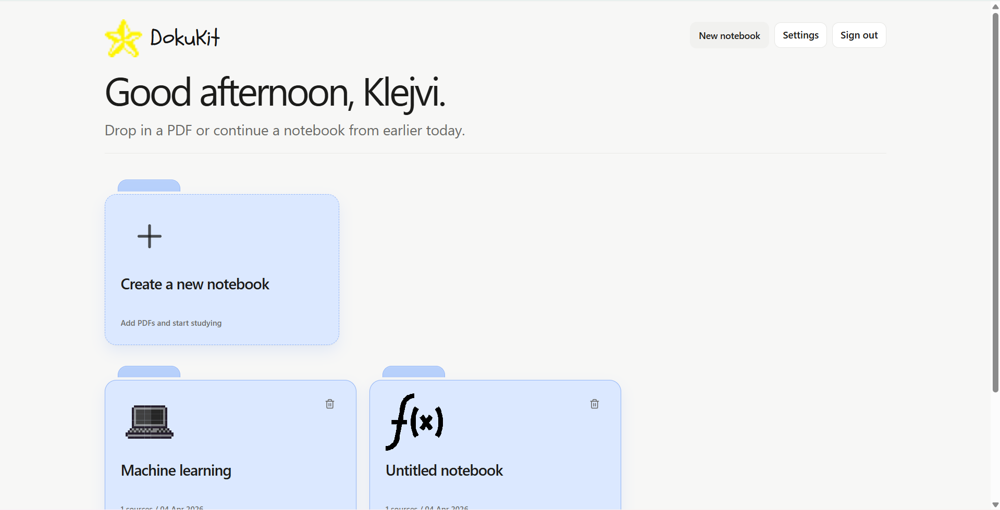
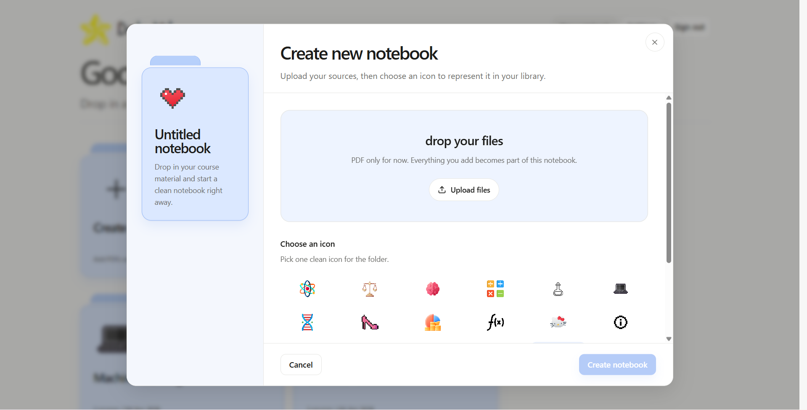
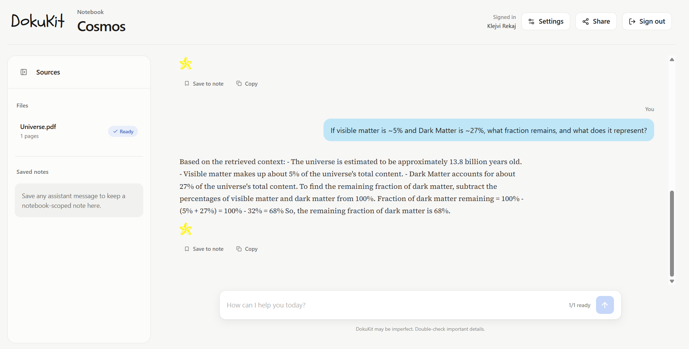

<div align="center">

# ⭐ DokuKit

**A document-grounded study workspace.**  
Upload PDFs, ask questions, save insights — all in one focused environment.

<br/>

[](LICENSE)
[](https://nextjs.org)
[](https://fastapi.tiangolo.com)
[](https://www.postgresql.org)

</div>

---

## Overview

DokuKit is a retrieval-augmented study environment built around notebooks. Upload your PDFs, chat with your documents, and organize everything into structured, shareable notebooks.

It's designed to be focused: no noise, just your documents and your questions.

---

## Screenshots

<br/>


> *Home dashboard — your notebooks at a glance.*

<br/>


> *Create a new notebook — upload PDFs and pick an icon.*

<br/>


> *Retrieval-augmented chat — ask questions, get answers grounded in your documents.*

---


## Features

- **Notebook workspaces** — organize your study sessions by topic or project
- **PDF ingestion** — upload and process documents automatically
- **RAG chat** — ask questions against your actual documents, not the open web
- **Streaming responses** — answers appear in real time via Server-Sent Events
- **Persistent history** — chat logs and notes are saved to your account
- **Notes** — save any assistant response with one click
- **Sharing** — generate a public read-only link for any notebook
- **Auth** — email/password authentication with session management
- **Themes** — light, dark, and system preference modes

---

## Tech Stack

### Frontend
| Tool | Role |
|---|---|
| Next.js (App Router) | Framework |
| React + TypeScript | UI layer |
| Tailwind CSS | Styling |
| Framer Motion | Animations |
| Radix UI | Accessible primitives |
| Lucide | Icons |

### Backend
| Tool | Role |
|---|---|
| FastAPI | API server |
| SQLAlchemy + Alembic | ORM + migrations |
| PostgreSQL | Database |
| Pydantic | Validation & settings |
| Server-Sent Events | Response streaming |

### AI / Retrieval
| Tool | Role |
|---|---|
| Qwen (local) | Answer generation |
| Local embeddings | Embedding provider |
| FAISS | Vector similarity search |

---

## How It Works

```
PDF upload → text extraction → chunking → embeddings → FAISS index
                                                              ↓
                                              user query → retrieval
                                                              ↓
                                            context + query → Qwen → streamed response
                                                              ↓
                                               saved to DB (chat / notes)
```

---

## Getting Started

### Prerequisites

- Node.js 18+
- Python 3.10+
- PostgreSQL instance
- Qwen model (running locally)

---

### 1. Clone the repository

```bash
git clone https://github.com/YOUR_USERNAME/YOUR_REPO.git
cd YOUR_REPO
```

### 2. Frontend setup

```bash
cd frontend
npm install
```

### 3. Backend setup

```bash
pip install -r backend/requirements.txt
```

### 4. Configure environment variables

```bash
cp backend/.env.example backend/.env
```

Edit `backend/.env` and fill in:

| Variable | Description |
|---|---|
| `DATABASE_URL` | PostgreSQL connection string |
| `SESSION_COOKIE_NAME` | Cookie name for sessions |
| `SESSION_COOKIE_SECURE` | Set `true` in production |
| `SESSION_COOKIE_SAMESITE` | Cookie policy (`lax` / `strict`) |

See [`backend/.env.example`](backend/.env.example) for the full list.

### 5. Run migrations

```bash
cd backend
alembic upgrade head
```

### 6. Start the backend

```bash
uvicorn app.main:app --host 127.0.0.1 --port 8000 --reload
```

### 7. Start the frontend

```bash
cd frontend
npm run dev
```

App runs at `http://localhost:3000`.

---

## Repository Structure

```
DocuKit/
├── backend/
│   ├── alembic/          # DB migrations
│   ├── app/              # FastAPI application
│   ├── requirements.txt
│   └── tests/
├── frontend/
│   ├── app/              # Next.js App Router pages
│   ├── components/       # Shared UI components
│   ├── features/         # Feature modules
│   ├── hooks/            # Custom React hooks
│   ├── lib/              # Utilities
│   ├── public/
│   └── package.json
├── scripts/
├── .gitignore
└── README.md
```

---

## Limitations

- PDF-only document support (no Word, Markdown, etc.)
- Local Qwen model — accuracy depends on the model size you run

---

## Development Notes

- A running PostgreSQL database configured via `DATABASE_URL` is required before starting the backend
- Uploaded files and FAISS indexes are stored locally and are not committed to Git
- CORS and cookie settings must be updated for production deployments

---

## License

This project is licensed under the [MIT License](LICENSE).

---

<div align="center">
  <sub>Built with FastAPI, Next.js, FAISS, and Qwen · Made for focused document work</sub>
</div>
